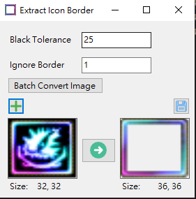
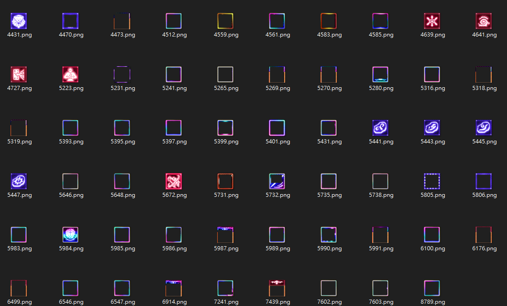

# IconBorderExtractor

**Extract Icon Borders from Lineage (?)**

This tool provides two methods to extract borders from icons:

## Methods

### 1. Load Images One by One
You can either drag and drop images from a folder or click the **Button**/**PictureBox** to load individual images.

### 2. Batch Convert Icons
Select the **Batch Convert** option and choose multiple icons to process them all at once.

## Notes
- The extraction process is not perfect in all cases. 
- You may need to adjust the **Black Tolerance** value to a higher setting for better results.
- After adjusting the value, press **Enter** to apply the changes and convert the image.
